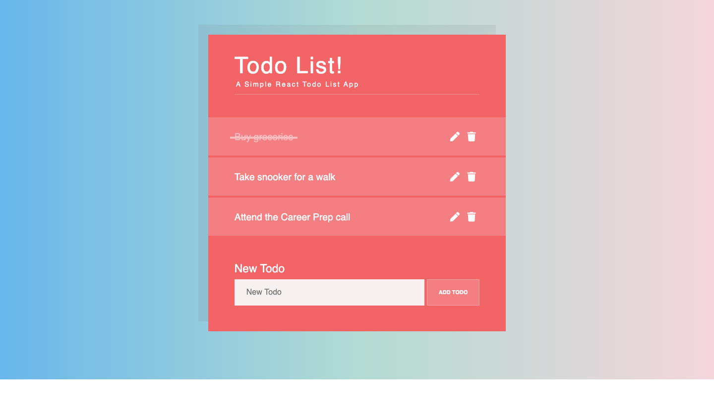

# ToDO Official

[ToDO List](https://todoofficial.netlify.com/) is a Todo App that allows users to see, add, edit, and remove todos



## Table of content

- [Description](#description)
- [Installation](#installation)
- [Contact](#contact)

## Description

ToDo list is a Todo App that allows users to see, add, edit, and remove todos. Other than that it implements the following rules:

- Alongside each Todo, it has a button with the text “Mark as completed”. When this button is clicked, there is a strike through the text of the todo.
- Instead of a button, button is refactored so that the todo itself can be clicked to mark it as completed. It also adds a strikethrough style to the Todo if it is completed. A user can toggle it on and off by clicking.
- It adds some styling to your application - a CSS animation that fades out a Todo when it is deleted
- Saves your todos in localStorage and retrieve them when the page loads.

## Installation

1. Clone the project to your local directory

```
git clone https://github.com/KaushikShivam/todo_list
```

2. The project uses NPM for managing dependencies. Run npm install to install all the required dependencies

```
npm install
```

3. Run the task runner to run the app

```
npm run start
```

## Contact

You can contact me at:

- [Portfolio](https://www.shivamkaushik.com)
- [Email](mailto:shivamkaushikofficial@gmail.com)
- [Linkedin](https://www.linkedin.com/in/kshivamdev/)
- [Twitter](https://twitter.com/kShivamDev)
- [Medium](https://medium.com/@shivamkaushikofficial)
- [Angellist](https://angel.co/kshivamdev)
